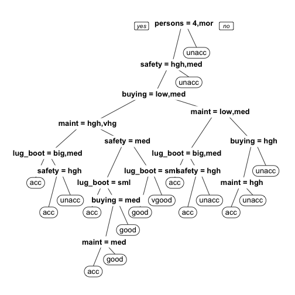

========================================================
author:  Subramanian L
date: 10-Sep-2016
transition: rotate
width: 1920
height: 1080
Developing Data Products  Assignment 
        - Car Selection | Prediction/ Category

Introduction
========================================================

This Assignment is about prediction of class/category of *Car*
acceptance based on various parameters.

Data for this assignment is obtained from **[UCI Machine Learning Repo](http://archive.ics.uci.edu/ml/datasets/Car+Evaluation)** 

Data set contains
- 1728 instances(rows)
- Target/class variable is Car Acceptance *( Very Good, Good,Acceptable, Unacceptable)*
- Predictor variables
    - Safety Aspects *(High,Medium,Low)*
    - No of passengers in car *(2,3,4,more)*
    - No of Doors in car *(2,4, more)*
    - Luggage/Boot size *(small,medium,large)*

Data retrieval and fitting a model
========================================================
* Classification model is built for Acceptance of Car purchase

```r
library('rpart')
library('rpart.plot')
car_data <- read.csv(url('http://archive.ics.uci.edu/ml/machine-learning-databases/car/car.data'))
colnames(car_data) <- c('buying','maint','doors','persons','lug_boot','safety','final_class')
fit <- rpart(final_class ~ ., data=car_data,method='class')
```

Tree for classification
========================================================
- R-part classification is used to fit the model of underlying data



- No of passenger is the root decision point
- Left/Righ branches corresponds to "Yes"/"No" of decision
- Leaves are the predicted outcome ( Acceptance of car)
    - acc (Acceptable)
    - unacc (Unacceptable)
    - good ( Good to buy)
    - vgood ( Very good to buy)
Prediction with test Input
========================================================
- A predication can be made with the model for below input
    - Input (Person=4 or more, safety=**high**,buying price=low,maint=high,lug_bot-medium)

        
        ```
        [1] "acc"
        ```

    - Input (Person=4 or more, safety=**low**,buying price=low,maint=high,lug_bot-medium)
        
        ```
        [1] "unacc"
        ```
 
